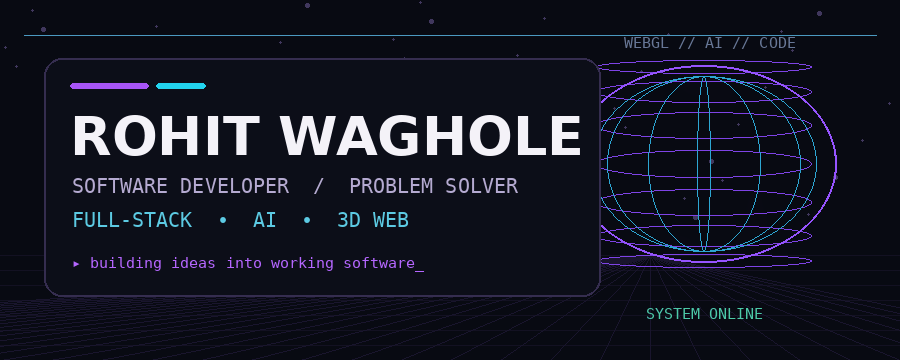
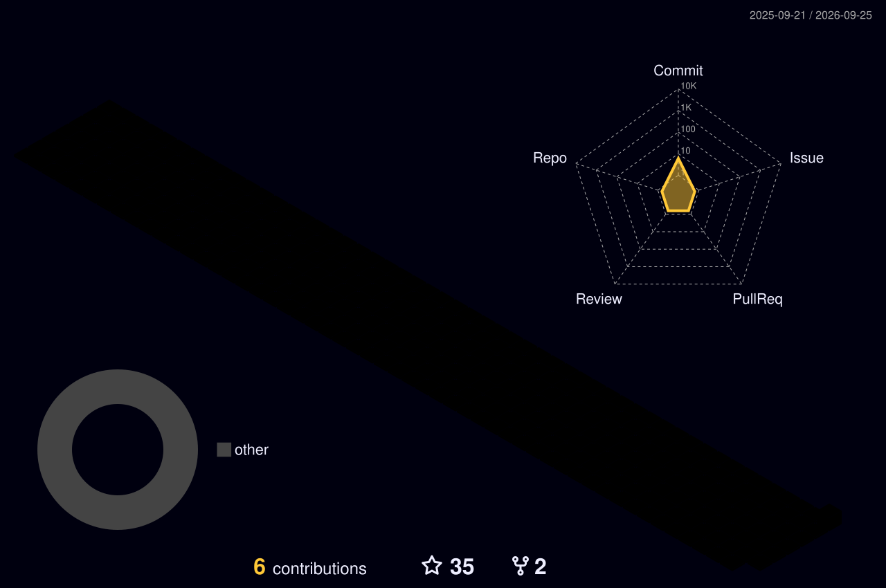

<p align="center">
  
</p>

<p align="center">
  <a href="https://github.com/RohitWaghole"></a>
  <a href="https://rohitwagholeportfolio.netlify.app/"></a>
  <a href="mailto:rohitwaghole2013@gmail.com"></a>
</p>

<p align="center">
  <code>SOFTWARE</code> • <code>WEB</code> • <code>AI</code> • <code>3D</code> • <code>PROBLEM SOLVING</code>
</p>

---

## `whoami`

```text
┌──────────────────────────────────────────────────────────────┐
│ ROHIT WAGHOLE                                                │
│                                                              │
│ Software developer who likes building things that are        │
│ useful, interactive, and a little unusual.                   │
│                                                              │
│ CURRENT INTERESTS                                            │
│   ├─ Modern web applications                                 │
│   ├─ Interactive 3D experiences                              │
│   ├─ AI / intelligent applications                           │
│   ├─ Python & computer vision                                │
│   └─ Backend systems & APIs                                  │
│                                                              │
│ BUILD → BREAK → LEARN → IMPROVE → SHIP                       │
└──────────────────────────────────────────────────────────────┘
```

## `what I build`

<table>
<tr>
<td width="50%"><h3>🌐 Web</h3>Modern frontend experiences, full-stack applications, APIs and the systems behind them.</td>
<td width="50%"><h3>◈ 3D</h3>Interactive browser experiences with WebGL / Three.js and creative interfaces.</td>
</tr>
<tr>
<td width="50%"><h3>🤖 AI</h3>Experiments and practical software around AI, automation and intelligent applications.</td>
<td width="50%"><h3>👁 Computer Vision</h3>Python and OpenCV projects exploring visual recognition and interaction.</td>
</tr>
</table>

---

## `stack`

### Frontend & 3D
<p></p>

### Backend & Data
<p></p>

### Tools
<p></p>

### Computer Vision
<p></p>

---

## `selected builds`

<table>
<tr>
<td width="50%"><h3>🌙 MarioNight</h3>Interactive JavaScript project exploring creative frontend interaction.<br><br><b>→ <a href="https://github.com/RohitWaghole/MarioNight">View repository</a></b></td>
<td width="50%"><h3>🧠 LeetCode</h3>Programming-problem solutions and algorithmic experiments.<br><br><b>→ <a href="https://github.com/RohitWaghole/Leetcode">View repository</a></b></td>
</tr>
<tr>
<td width="50%"><h3>👁 Hand Detection</h3>Python + OpenCV project exploring hand detection.<br><br><b>→ <a href="https://github.com/RohitWaghole/OpenCV-Hand-Detection">View repository</a></b></td>
<td width="50%"><h3>👤 Face & Eye Detection</h3>Computer-vision experiments using Python and OpenCV.<br><br><b>→ <a href="https://github.com/RohitWaghole/OpenCV-Face-and-Eye-detection">View repository</a></b></td>
</tr>
</table>

---

<details>
<summary><b>🧪 More about what I'm exploring</b></summary>

<br />

I like learning through implementation rather than collecting technologies.

```text
idea
  ↓
prototype
  ↓
debug
  ↓
refactor
  ↓
ship
  ↓
next problem
```

</details>

---

## `github // 3d`

<p align="center">
  <picture>
    <source media="(prefers-color-scheme: dark)" srcset="./profile-3d-contrib/profile-night-rainbow.svg" />
    <source media="(prefers-color-scheme: light)" srcset="./profile-3d-contrib/profile-green.svg" />
    
  </picture>
</p>

## `github // snake`

<p align="center">
  <picture>
    <source media="(prefers-color-scheme: dark)" srcset="./github-snake-dark.svg" />
    <source media="(prefers-color-scheme: light)" srcset="./github-snake.svg" />
    
  </picture>
</p>

---

## `connect`

<p align="center">
  <a href="https://rohitwagholeportfolio.netlify.app/"></a>
  <a href="https://github.com/RohitWaghole"></a>
  <a href="mailto:rohitwaghole2013@gmail.com"></a>
</p>

<p align="center"><sub>Build things. Break things. Learn. Repeat.</sub></p>
